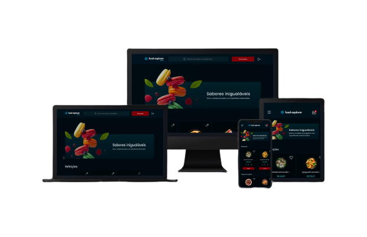

## 🍔 Food Explorer
O App Food Explorer é um projeto CRUD de um menu interativo, projetado para o restaurante fictício Food Explorer. O App oferece um conjunto robusto de recursos para que os usuários desfrutem de uma experiência personalizada.

  

## 🔐 Contas de Demonstração
Para facilitar os testes da aplicação, disponibilizo estas contas de demonstração com diferentes níveis de acesso:

**Admin**
- E-mail: admin@email.com
- Senha: 123456
- Como administrador, você tem acesso total à aplicação, incluindo a capacidade de adicionar, editar e excluir itens do menu.

**Usuário Comum**
- E-mail: usuario@email.com
- Senha: 123456
- Os usuários normais têm acesso limitado e podem visualizar o menu, adicionar itens ao carrinho e gerenciar seus favoritos.

- Sinta-se à vontade para usar estas contas de demonstração para explorar a nossa aplicação.

- Observação: Lembre-se de que estas são contas de demonstração e não devem ser usadas para fins de produção ou para armazenar informações sensíveis.

## 📱 Preview da Aplicação
- Você pode experimentar a aplicação no ar através do seguinte link:

- **Acessar o Food Explorer:** https://ifoodexplorervictorparanhosdev.netlify.app/

- Explore todos os recursos e desfrute da experiência completa!

## 📋 Recursos Principais
**- Gerenciamento de Usuários** 👨‍💼
- Criação de Conta de Usuário: Permite que os usuários criem uma nova conta, fornecendo informações básicas como nome, e-mail e senha.
- Gerenciamento de Pratos 🍽️
- Listagem de Pratos: Fornece uma lista de pratos disponíveis no cardápio.
- Criação de Novos Pratos: Permite que os administradores do restaurante adicionem novos pratos ao cardápio, incluindo nome, descrição, categoria, imagem e preço.
- Atualização de Pratos: Permite que os administradores atualizem as informações de pratos existentes.
- Deleção de Pratos: Permite que os administradores removam pratos do cardápio.

**- Gerenciamento de Favoritos** ❤️
- Criação de Favoritos: Permite que os usuários marquem pratos como favoritos para acesso rápido.
- Deleção de Favoritos: Permite que os usuários removam pratos da lista de favoritos.

## 🌟 Mais Recursos

- Cardápio Digital Personalizado: Oferece um cardápio digital com uma variedade de pratos, cada um com descrição, preço e imagem, permitindo aos usuários explorarem as opções de refeições de forma conveniente.
- Autenticação Segura: Tokens JWT para garantir a autenticação segura entre o front-end e a API, protegendo os dados do usuário e a integridade da conta.
- Experiência Intuitiva: O APP é projetada para ser fácil de usar e oferecer uma experiência de usuário fluida, tanto para os administradores de restaurantes quanto para os clientes.
- Com recursos abrangentes de gerenciamento de pratos, autenticação segura e um cardápio digital personalizado, o APP oferece diversos recursos.

## 🌐 Frontend
- O projeto Food Explorer é um Web App que simula um menu interativo de um restaurante fictício. Ele oferece uma experiência envolvente aos usuários, permitindo que eles explorem os pratos, bebidas e opções do cardápio de forma interativa e visualmente atraente. Com o Food Explorer, os clientes podem navegar pelos pratos, ver imagens, descrições e informações detalhadas sobre cada item, criando uma experiência gastronômica virtual única.

## ⚙️ Backend
- A API Restful FoodExplorer foi projetado para ser uma ponte entre o Front-End e o Back-End do restaurante virtual fictício Food Explorer. Ao consumir essa API, o projeto será capaz de criar, listar, atualizar e deletar informações sobre usuários, pratos e favoritos, proporcionando aos usuários uma experiência completa e rica em recursos.

**Como Configurar e Executar Localmente:**
- Faça um pull do BackEnd: https://github.com/victorparanhosdev/api-foodexplorer
- e do FrontEnd: https://github.com/victorparanhosdev/foodexplorer-react

- Logo em seguida configure e instale as dependencias do projeto para que ele funcione corretamente.
- no BackEnd: execute o "npm install", "npm run migrate" e "npm run dev"
- no FrontEnd: você deve ir "./src/services/api.js" e configurar na baseURL para "http://localhost:3003/" e executar no terminal, os comandos "npm install" e "npm run dev"
